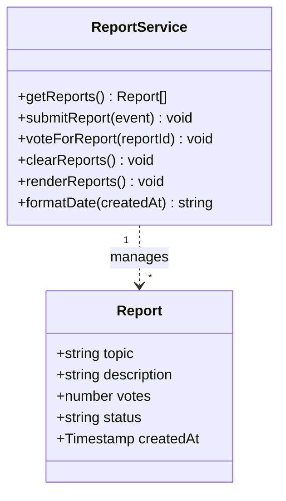

# Class Diagram

## Project

Course Confusion Radar Application

## Notes

The current implementation uses a functional JavaScript style rather than
traditional OOP classes. The diagram below represents the data structure
and responsibilities conceptually: `Report` models the data entity stored
in Firestore, and `ReportService` groups the functions in `script.js` that
operate on it.

