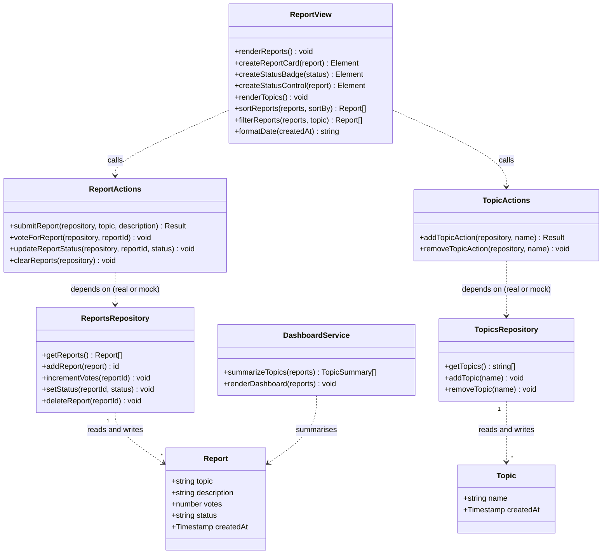

# Class Diagram

## Project

Course Confusion Radar Application

## Notes

The current implementation uses a functional JavaScript style rather than
traditional OOP classes. The diagram below represents the data structure and
responsibilities conceptually, updated for the Practical 8 Mock Object
refactor. `Report` and `Topic` model the data entities stored in Firestore.

Firestore access now sits behind a repository interface, implemented for real
by `ReportsRepository`/`TopicsRepository` (`firestoreRepository.js`).
`ReportActions`/`TopicActions` (`reportActions.js`/`topicActions.js`) contain
the orchestration logic and depend only on that repository interface, not on
Firestore directly, which is what lets a Mock Object replace the repository in
tests (see `docs/mock-object-notes.md`). `ReportView` (DOM rendering in
`script.js`) calls the action modules instead of talking to Firestore
directly. `DashboardService` is the lecturer dashboard aggregation added in
Iteration 2. The pure functions `summarizeTopics`, `sortReports`,
`filterReports`, `addTopic`, and `removeTopic` take plain data and return
plain data without touching the DOM or Firestore, which keeps them
unit-testable.

