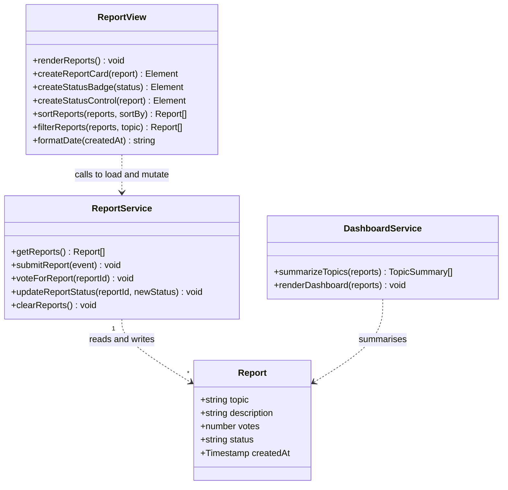

# Class Diagram

## Project

Course Confusion Radar Application

## Notes

The current implementation uses a functional JavaScript style rather than
traditional OOP classes. The diagram below represents the data structure and
responsibilities conceptually. `Report` models the data entity stored in
Firestore. The functions in `script.js` are grouped into three conceptual
responsibility groups: `ReportService` (Firestore data access and mutation),
`ReportView` (building the report list DOM), and `DashboardService` (the
lecturer dashboard aggregation added in Iteration 2). The pure functions
`summarizeTopics`, `sortReports`, and `filterReports` take report arrays and
return report arrays without touching the DOM or Firestore, which keeps them
unit-testable.

