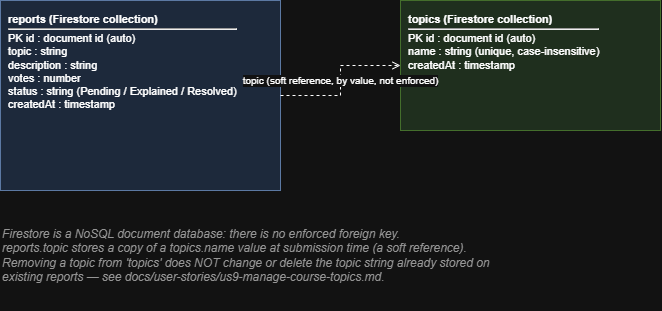

# Database Design

## Project
Course Confusion Radar Application

## Diagram (online tool)

Created with [diagrams.net (draw.io)](https://app.diagrams.net), an online
diagramming tool, per the Practical rubric's design requirement. The native
source file is [`database-design.drawio`](database-design.drawio) (open it at
app.diagrams.net to edit).

## Notes

The database is Firebase Firestore (project `cp3407-800c5`), a NoSQL document
database, not a relational database — there are no tables, joins, or enforced
foreign keys. There are two top-level collections:

### `reports`
| Field | Type | Notes |
|---|---|---|
| id | document id (auto) | assigned by Firestore |
| topic | string | a copy of a `topics.name` value at submission time |
| description | string | the student's confusion description |
| votes | number | starts at 0, incremented by `voteForReport` |
| status | string | `Pending`, `Explained`, or `Resolved` |
| createdAt | timestamp | set with `serverTimestamp()` |

### `topics`
| Field | Type | Notes |
|---|---|---|
| id | document id (auto) | assigned by Firestore |
| name | string | unique (checked case-insensitively by `addTopic` in `logic.js` before writing) |
| createdAt | timestamp | set with `serverTimestamp()` |

### The `reports.topic` → `topics.name` relationship is a soft reference

Because Firestore has no foreign keys, nothing stops `reports.topic` from
holding a value that no longer exists in `topics` — for example after an
admin removes a topic (US9). This is a known, accepted limitation, not a bug:
`docs/user-stories/us9-manage-course-topics.md` documents it explicitly, and
`docs/system-testing-plan.md` lists it as a known limitation to mention during
the demo. Enforcing referential integrity (e.g. blocking removal of a topic
that is still in use, or cascading the change to existing reports) was judged
out of scope for this project.

## Related Files
- `firestoreRepository.js` (`createFirestoreReportsRepository`, `createFirestoreTopicsRepository`)
- `logic.js` (`addTopic`, `removeTopic` — the uniqueness check)
- `docs/user-stories/us9-manage-course-topics.md`
