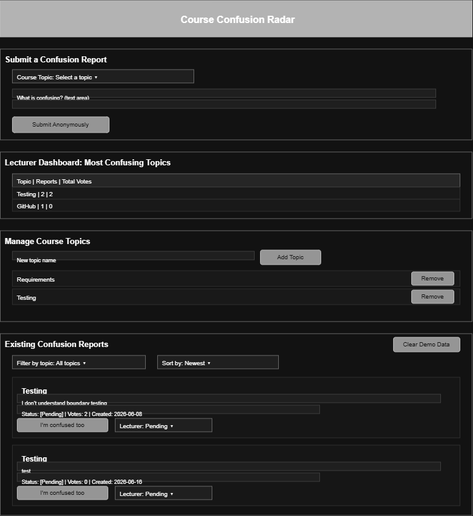

# Interface Design

## Project
Course Confusion Radar Application

## Prototype (online tool)

Created with [diagrams.net (draw.io)](https://app.diagrams.net), used here as
a wireframing/prototyping tool, per the Practical rubric's design requirement.
The native source file is
[`interface-prototype.drawio`](interface-prototype.drawio) (open it at
app.diagrams.net to edit).

## Notes

The application is a single continuous page rather than a multi-screen flow,
so the prototype is one wireframe of the full page layout, matching
`index.html`'s actual section order top to bottom, rather than several
separate mockups for different "screens":

1. **Header** — page title.
2. **Submit a Confusion Report** — topic dropdown, description text area, submit button (US1/US2).
3. **Lecturer Dashboard: Most Confusing Topics** — a table row per topic, ordered by votes (US6).
4. **Manage Course Topics** — an add-topic form and a list of topics with a Remove button each (US9).
5. **Existing Confusion Reports** — filter and sort controls, a "Clear Demo Data" button, and one card per report with a vote button and a lecturer status control (US3/US4/US5/US7/US8/US10).

This wireframe was drawn from the already-implemented `index.html`/`styles.css`
layout (the interface existed before this document, built incrementally
story by story from Iteration 1 onward) rather than the reverse; it documents
the interface design rather than having driven it. It is included to satisfy
the Practical rubric's requirement to produce an interface design using a
prototyping tool, and to give a single-page overview of the whole UI's
structure for anyone reading the documentation before opening the live app.

## Related Files
- `index.html`
- `styles.css`
- `script.js`
