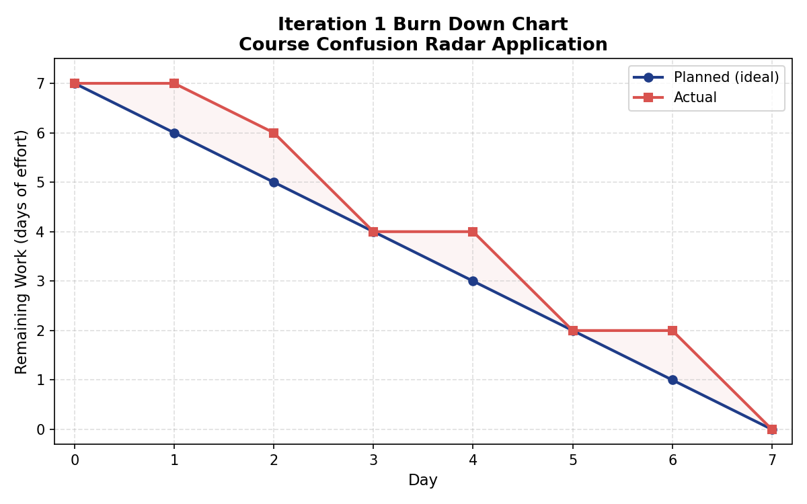

# Iteration 1 Burn Down Graph

## Project

Course Confusion Radar Application

## Iteration 1 Goal

The goal of Iteration 1 is to build the core student confusion report workflow.

---

## Total Estimated Work

| User Story                            |     Effort |
| ------------------------------------- | ---------: |
| US1 Submit Anonymous Confusion Report |     2 days |
| US2 Select Course Topic               |      1 day |
| US3 View Existing Confusion Reports   |     2 days |
| US4 Vote "I'm Confused Too"           |     2 days |
| **Total**                             | **7 days** |

---

## Burn Down Data

| Day   | Planned Remaining Work | Actual Remaining Work | Notes                                                        |
| ----- | ---------------------: | --------------------: | ------------------------------------------------------------ |
| Day 0 |                      7 |                     7 | Iteration 1 started. Project structure and page layout set up. |
| Day 1 |                      6 |                     7 | Interface prepared, but no user story fully completed yet.   |
| Day 2 |                      5 |                     6 | US2 Select Course Topic completed (1 day).                   |
| Day 3 |                      4 |                     4 | US1 Submit Anonymous Confusion Report completed (2 days).    |
| Day 4 |                      3 |                     4 | Firestore database integration in progress.                  |
| Day 5 |                      2 |                     2 | US3 View Existing Confusion Reports completed (2 days).      |
| Day 6 |                      1 |                     2 | US4 Vote "I'm Confused Too" in progress.                    |
| Day 7 |                      0 |                     0 | US4 completed. All Iteration 1 user stories done.           |

---

## Burn Down Graph

The chart shows planned (ideal) remaining work against actual remaining work across the 7-day iteration.

---

## Progress Reflection

The burn down graph shows that all four Iteration 1 user stories were completed by the end of the iteration. The actual line stayed slightly above the planned line during the early and middle days, mainly because the first day was spent setting up the page structure without completing a user story, and integrating the Firestore database took additional time on Day 4. Progress then caught up, and the remaining work reached zero by Day 7.