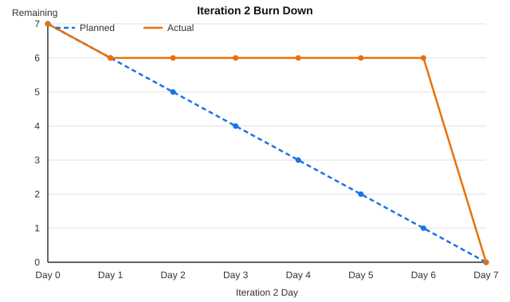

# Iteration 2 Burn Down Graph

## Project

Course Confusion Radar Application

## Iteration 2 Goal

The goal of Iteration 2 is to build the lecturer-side review features on top of
the Iteration 1 workflow: report status, a lecturer dashboard, sorting,
resolving reports, and filtering.

---

## Total Estimated Work

| User Story                      |     Effort |
| -------------------------------- | ---------: |
| US5 View Report Status           |     1 day |
| US6 Lecturer Dashboard           |     3 days |
| US7 Sort Reports by Votes        |     1 day |
| US8 Mark Report as Resolved      |     1 day |
| US10 Filter Reports by Topic     |     1 day |
| **Total**                        | **7 days** |

---

## Burn Down Data

| Day   | Planned Remaining Work | Actual Remaining Work | Notes                                                              |
| ----- | ---------------------: | ---------------------: | ------------------------------------------------------------------- |
| Day 0 |                      7 |                       7 | Iteration 2 started.                                                |
| Day 1 |                      6 |                       6 | US5 View Report Status completed (1 day).                          |
| Day 2 |                      5 |                       6 | No further stories landed yet.                                     |
| Day 3 |                      4 |                       6 | Gap between US5 and the Practical 6 implementation session.        |
| Day 4 |                      3 |                       6 | Gap continues.                                                     |
| Day 5 |                      2 |                       6 | Gap continues.                                                     |
| Day 6 |                      1 |                       6 | Gap continues.                                                     |
| Day 7 |                      0 |                       0 | US6, US7, US8, and US10 (6 days) all completed in one session.     |

---

## Burn Down Graph

The chart shows planned (ideal) remaining work against actual remaining work
across the 7-day iteration.

---

## Progress Reflection

Unlike Iteration 1, where progress tracked the planned line fairly closely,
Iteration 2's actual line stayed flat for most of the iteration and then
dropped straight to zero. US5 was implemented early and on the planned pace,
but US6, US7, US8, and US10 were all implemented together in a single
concentrated Practical 6 session rather than spread across the iteration. The
total effort still matched the 7-day estimate exactly (see
[Iteration 2 Review](iteration-2-review.md)), so the estimation itself was
accurate; the lesson for Iteration 3 is to expect similarly bursty delivery
rather than a smooth day-by-day burn down, and not to read a flat middle
section as a sign the iteration is off track.
