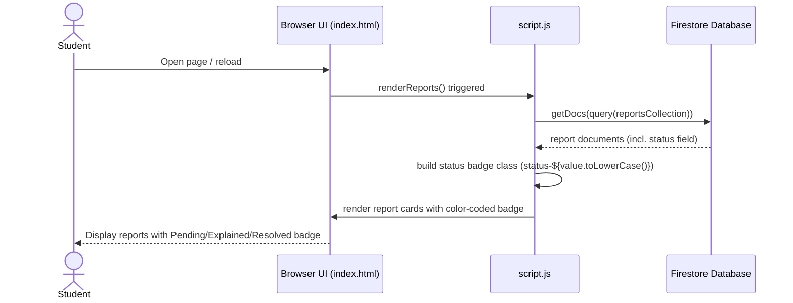

# Sequence Diagram: US5 Report Status Display

## Project

Course Confusion Radar Application

## Description

This diagram illustrates the flow when a student opens the page and views
the color-coded status badge (Pending/Explained/Resolved) for each
confusion report.

